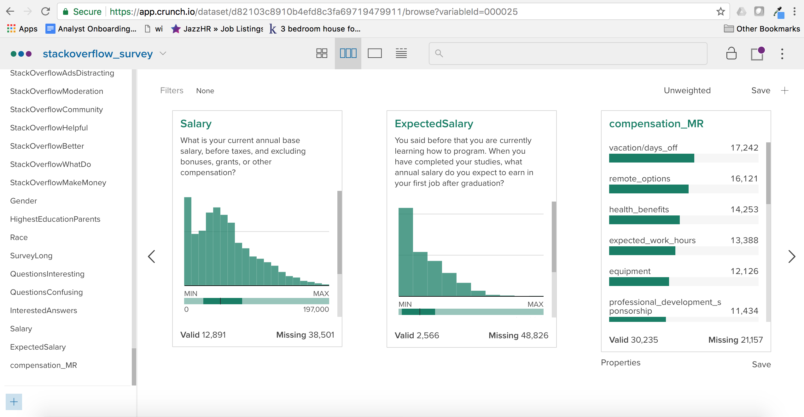

Analyzing the Stackoverflow developers survey in Crunch
=======================================================

Survey designers often use data structures which make it easy to collect survey
responses even if those structures are somewhat difficult to analyze. The result
is that analysts can be faced with a number of tedious or difficult tasks before
they can actually get insight from the data. Crunch was developed to make it
easier to work with this kind of awkward data structures. To provide a concrete
example, lets take a look at the StackOverflow developer survey.

~~~~~~~~~~~~~~~~~~~~~~~~~~~~~~~~~~~~~~~~~~~~~~~~~~~~~~~~~~~~~~~~~~~~~~~~~~~~~~ r
library(crunch)
library(tidyverse)
library(stringr)
stack_df <- read_csv("survey_results_public.csv")
schema <- read_csv("survey_results_schema.csv")
~~~~~~~~~~~~~~~~~~~~~~~~~~~~~~~~~~~~~~~~~~~~~~~~~~~~~~~~~~~~~~~~~~~~~~~~~~~~~~~~

The first step is to upload the main survey to the crunch platform.

~~~~~~~~~~~~~~~~~~~~~~~~~~~~~~~~~~~~~~~~~~~~~~~~~~~~~~~~~~~~~~~~~~~~~~~~~~~~~~~~
ds <- newDataset(stack_df, name = "stackoverflow_survey")
~~~~~~~~~~~~~~~~~~~~~~~~~~~~~~~~~~~~~~~~~~~~~~~~~~~~~~~~~~~~~~~~~~~~~~~~~~~~~~~~

In the Crunch app we can take a look at some variable summaries to start to get
a sense of the data structure.

The StackOverflow questions are stored in two distinct formats, theres's a human
readable version which is presented to the respondant, and a machine readable
one which is stored as the variable names. One of the first, and most frequent
questions that you'll likely ask when analyzing this survey is "what was that
question again?". The StackOverflow team has helpfully provided the survey
schema and Questionaire which shows the relationship between the variable names
and the questions, but there's not a natural way to store this information in
either a csv file or an R dataframe. Storing the questions in the first row of
the table is probably a bad idea, so you will probably end up just keeping the
schema and questionaire in separate files and cross-referencing them when
needed.

Crunch allows you to store more information than just the name about the
variable and so we can take the question information from the schema and assign
it to the variable description.

~~~~~~~~~~~~~~~~~~~~~~~~~~~~~~~~~~~~~~~~~~~~~~~~~~~~~~~~~~~~~~~~~~~~~~~~~~~~~~ r
descriptions(variables(ds)) <- schema$Question
~~~~~~~~~~~~~~~~~~~~~~~~~~~~~~~~~~~~~~~~~~~~~~~~~~~~~~~~~~~~~~~~~~~~~~~~~~~~~~~~

In the app the descriptions show up just under the variable name.

There are a couple of pieces of this survey which illustrate some of the pain
points faced by survey analysts. First let's take a look at Q149 which asks
respondents to rate how important various factors would be if they were the
hiring manager at a major technology company. When the question is asked all of
the possibilities are presented together:

>   Q491.Congratulations! You’ve just been put in charge of technical recruiting
>   at Globex, a multinational high-tech firm. This job comes with a corner
>   office, and you have an experienced staff of recruiters at your disposal.
>   All they need to be successful is a sense of the relative importance they
>   should place on each of the following when recruiting software developers.
>   What do you tell them?

>   Knowledge of algorithms and data structures

>   Experience with specific tools (libraries, frameworks, etc.) used by the
>   employer

>   Communication skills

>   Contributions to open source projects

>   Experience with specific project management tools & techniques

>   Previous companies worked at

>   Previous job titles held

>   Educational credentials (e.g. schools attended, specific field of study,
>   grades earned)

>   Stack Overflow reputation

But the limits of tabular data structures means that the answers to these
questions are broken up into a bunch of separate variables:

~~~~~~~~~~~~~~~~~~~~~~~~~~~~~~~~~~~~~~~~~~~~~~~~~~~~~~~~~~~~~~~~~~~~~~~~~~~~~~ r
vars <- schema$Column[str_detect( schema$Question, "Congratulations! You've just been put in charge of technical recruiting at Globex")]

stack_df %>% 
    filter(row_number() ==1:10) %>% 
    select(one_of(vars)) %>% 
        knitr::kable()
~~~~~~~~~~~~~~~~~~~~~~~~~~~~~~~~~~~~~~~~~~~~~~~~~~~~~~~~~~~~~~~~~~~~~~~~~~~~~~~~

~~~~~~~~~~~~~~~~~~~~~~~~~~~~~~~~~~~~~~~~~~~~~~~~~~~~~~~~~~~~~~~~~~~~~~~~~~~~~~~~
## Warning in 1:51392 == 1:10: longer object length is not a multiple of
## shorter object length
~~~~~~~~~~~~~~~~~~~~~~~~~~~~~~~~~~~~~~~~~~~~~~~~~~~~~~~~~~~~~~~~~~~~~~~~~~~~~~~~

| ImportantHiringAlgorithms | ImportantHiringTechExp | ImportantHiringCommunication | ImportantHiringOpenSource | ImportantHiringPMExp | ImportantHiringCompanies | ImportantHiringTitles | ImportantHiringEducation | ImportantHiringRep   | ImportantHiringGettingThingsDone |
|---------------------------|------------------------|------------------------------|---------------------------|----------------------|--------------------------|-----------------------|--------------------------|----------------------|----------------------------------|
| Important                 | Important              | Important                    | Somewhat important        | Important            | Not very important       | Not very important    | Not at all important     | Somewhat important   | Very important                   |
| Important                 | Important              | Important                    | Important                 | Somewhat important   | Somewhat important       | Not very important    | Somewhat important       | Not very important   | Very important                   |
| NA                        | NA                     | NA                           | NA                        | NA                   | NA                       | NA                    | NA                       | NA                   | NA                               |
| Somewhat important        | Somewhat important     | Very important               | Very important            | Somewhat important   | Somewhat important       | Not very important    | Not very important       | Important            | Very important                   |
| NA                        | NA                     | NA                           | NA                        | NA                   | NA                       | NA                    | NA                       | NA                   | NA                               |
| Not very important        | Not very important     | Not very important           | Important                 | Not very important   | Not very important       | Not very important    | Not very important       | Not at all important | Not very important               |
| Very important            | Important              | Important                    | Somewhat important        | Somewhat important   | Somewhat important       | Somewhat important    | Somewhat important       | Not very important   | Very important                   |
| Somewhat important        | Somewhat important     | Important                    | Somewhat important        | Not very important   | Somewhat important       | Not very important    | Somewhat important       | Not very important   | Important                        |
| NA                        | NA                     | NA                           | NA                        | NA                   | NA                       | NA                    | NA                       | NA                   | NA                               |
| NA                        | NA                     | NA                           | NA                        | NA                   | NA                       | NA                    | NA                       | NA                   | NA                               |

A better solution would be to store the responses to this question in some kind
of tabular structure which showed the relationship between them. For instance we
could calculate a frequency table which showed the percentage of respondents who
gave a variable a particular rating. We can do this locally in R with something
like the following:

~~~~~~~~~~~~~~~~~~~~~~~~~~~~~~~~~~~~~~~~~~~~~~~~~~~~~~~~~~~~~~~~~~~~~~~~~~~~~~ r
catarray <- stack_df[, vars] %>% 
    gather(variable, rating) %>% 
    group_by(variable, rating) %>% 
    tally() %>%
    filter(!is.na(rating)) %>% 
    mutate(n = scales::percent(n/sum(n))) %>% 
    spread(rating, n) 
catarray$variable <- str_replace(catarray$variable, "ImportantHiring", "")
catarray[ ,c("variable", "Very important",
    "Important", "Somewhat important", "Not very important", "Not at all important")] %>% 
    knitr::kable()
~~~~~~~~~~~~~~~~~~~~~~~~~~~~~~~~~~~~~~~~~~~~~~~~~~~~~~~~~~~~~~~~~~~~~~~~~~~~~~~~

| variable          | Very important | Important | Somewhat important | Not very important | Not at all important |
|-------------------|----------------|-----------|--------------------|--------------------|----------------------|
| Algorithms        | 22.6%          | 41.4%     | 27.5%              | 7.3%               | 1.2%                 |
| Communication     | 34.1%          | 45.9%     | 16.6%              | 2.9%               | 0.5%                 |
| Companies         | 3.2%           | 19.6%     | 41.1%              | 29.1%              | 7.0%                 |
| Education         | 3.5%           | 18.9%     | 38.5%              | 28.9%              | 10.1%                |
| GettingThingsDone | 34.8%          | 44.7%     | 16.5%              | 3.3%               | 0.8%                 |
| OpenSource        | 5.3%           | 19.0%     | 36.4%              | 30.4%              | 9.0%                 |
| PMExp             | 6.1%           | 22.7%     | 34.6%              | 28.2%              | 8.4%                 |
| Rep               | 2.3%           | 9.0%      | 26.5%              | 37.7%              | 24.5%                |
| TechExp           | 15.9%          | 37.6%     | 32.4%              | 12.3%              | 1.8%                 |
| Titles            | 3.0%           | 18.7%     | 37.6%              | 29.8%              | 10.9%                |

This picture is great for summarizing a set of related categorical variables,
but it's a bit of a pain to produce, and is difficult to display alongside other
variable summaries. Since this is such a common task, Crunch has a special data
type called a "catagorical array" for working with related catagorical
variables.

~~~~~~~~~~~~~~~~~~~~~~~~~~~~~~~~~~~~~~~~~~~~~~~~~~~~~~~~~~~~~~~~~~~~~~~~~~~~~~ r
ds$importanceHiringArray <- makeArray(ds[, vars], name = "Importance to Hiring")
knitr::include_graphics('./images/catarray_screen.png')
~~~~~~~~~~~~~~~~~~~~~~~~~~~~~~~~~~~~~~~~~~~~~~~~~~~~~~~~~~~~~~~~~~~~~~~~~~~~~~~~

Another common survey response datatype can be found in Q350

>   Q350. When it comes to compensation and benefits, other than base salary,
>   which of the following are the most important to you? Please choose no more
>   than X.

>   \- Stock options

>   \- Retirement/pension contributions

>   \- Opportunity for an annual bonus

>   \- The number of annual days off (vacation, holidays, etc.)

>   \- Employer match of charitable contributions

>   \- Health benefits

>   \- Employer purchase of high-quality equipment (workstation, monitor, etc.)

>   \- Private office

>   \- Employer sponsorship of professional development (e.g. conference
>   attendance, course enrollment)

>   \- Employer sponsorship of education (e.g. tuition reimbursement)

>   \- Long-term leave policies (e.g. parental leave, sabbatical)

>   \- Number of expected work hours each week \* The ability to work from home

>   \- Child or elder care benefits

This is a multiple response quetion which allows respondents to select a number
of factors which they consider important. The reponses are stored in semi-colon
deliminted lists:

~~~~~~~~~~~~~~~~~~~~~~~~~~~~~~~~~~~~~~~~~~~~~~~~~~~~~~~~~~~~~~~~~~~~~~~~~~~~~~ r
stack_df[1:10, c("Respondent", "ImportantBenefits")] %>% 
    knitr::kable()
~~~~~~~~~~~~~~~~~~~~~~~~~~~~~~~~~~~~~~~~~~~~~~~~~~~~~~~~~~~~~~~~~~~~~~~~~~~~~~~~

| Respondent | ImportantBenefits                                                                                       |
|------------|---------------------------------------------------------------------------------------------------------|
| 1          | Stock options; Vacation/days off; Remote options                                                        |
| 2          | NA                                                                                                      |
| 3          | NA                                                                                                      |
| 4          | Stock options; Annual bonus; Health benefits; Equipment; Private office                                 |
| 5          | NA                                                                                                      |
| 6          | Vacation/days off; Expected work hours                                                                  |
| 7          | Health benefits; Equipment; Professional development sponsorship; Education sponsorship; Remote options |
| 8          | Equipment; Professional development sponsorship; Expected work hours; Remote options                    |
| 9          | Stock options; Annual bonus; Health benefits; Equipment; Remote options                                 |
| 10         | Vacation/days off; Long-term leave; Expected work hours; Remote options; Child/elder care               |

The first task is to split up the responses into columns which show whether a
respondent selected a particular option.

~~~~~~~~~~~~~~~~~~~~~~~~~~~~~~~~~~~~~~~~~~~~~~~~~~~~~~~~~~~~~~~~~~~~~~~~~~~~~~ r
str_to_var <- function(str){
    str <- str[!is.na(str)]
    out <- data.frame(matrix(ncol = length(str), nrow = 1))
    out[1, ] <- "selected"
    names(out) <- str
    out
}
mr_vars <- stack_df$ImportantBenefits %>% 
    str_split("; ") %>% 
    map(str_to_var) %>% 
    bind_rows()

head(mr_vars) %>% 
    knitr::kable()
~~~~~~~~~~~~~~~~~~~~~~~~~~~~~~~~~~~~~~~~~~~~~~~~~~~~~~~~~~~~~~~~~~~~~~~~~~~~~~~~

| Stock options | Vacation/days off | Remote options | Annual bonus | Health benefits | Equipment | Private office | Expected work hours | Professional development sponsorship | Education sponsorship | Long-term leave | Child/elder care | Retirement | Meals | Charitable match | Other | None of these |
|---------------|-------------------|----------------|--------------|-----------------|-----------|----------------|---------------------|--------------------------------------|-----------------------|-----------------|------------------|------------|-------|------------------|-------|---------------|
| selected      | selected          | selected       | NA           | NA              | NA        | NA             | NA                  | NA                                   | NA                    | NA              | NA               | NA         | NA    | NA               | NA    | NA            |
| NA            | NA                | NA             | NA           | NA              | NA        | NA             | NA                  | NA                                   | NA                    | NA              | NA               | NA         | NA    | NA               | NA    | NA            |
| NA            | NA                | NA             | NA           | NA              | NA        | NA             | NA                  | NA                                   | NA                    | NA              | NA               | NA         | NA    | NA               | NA    | NA            |
| selected      | NA                | NA             | selected     | selected        | selected  | selected       | NA                  | NA                                   | NA                    | NA              | NA               | NA         | NA    | NA               | NA    | NA            |
| NA            | NA                | NA             | NA           | NA              | NA        | NA             | NA                  | NA                                   | NA                    | NA              | NA               | NA         | NA    | NA               | NA    | NA            |
| NA            | selected          | NA             | NA           | NA              | NA        | NA             | selected            | NA                                   | NA                    | NA              | NA               | NA         | NA    | NA               | NA    | NA            |

This creates a dataframe with each multiple response option as a variable, and
the selection indicated by either "selected" or NA. We can now convert it to a
factors and upload it to Crunch.

~~~~~~~~~~~~~~~~~~~~~~~~~~~~~~~~~~~~~~~~~~~~~~~~~~~~~~~~~~~~~~~~~~~~~~~~~~~~~~ r
mr_vars[] <- map(mr_vars, as.factor)
names(mr_vars) <- str_replace_all(names(mr_vars), " ", "_") %>% 
    str_to_lower()
var_defs <- map2(mr_vars, names(mr_vars), ~toVariable(.x, name = .y))
addVariables(ds, var_defs)
ds <- refresh(ds)
~~~~~~~~~~~~~~~~~~~~~~~~~~~~~~~~~~~~~~~~~~~~~~~~~~~~~~~~~~~~~~~~~~~~~~~~~~~~~~~~

The last step is to create the multiple response variable:

~~~~~~~~~~~~~~~~~~~~~~~~~~~~~~~~~~~~~~~~~~~~~~~~~~~~~~~~~~~~~~~~~~~~~~~~~~~~~~ r
ds$compensation_MR <- makeMR(ds[, names(mr_vars)], 
    selections = "selected", name = "compensation_MR")
~~~~~~~~~~~~~~~~~~~~~~~~~~~~~~~~~~~~~~~~~~~~~~~~~~~~~~~~~~~~~~~~~~~~~~~~~~~~~~~~

The multiple response variable card displays the multiple response variable in a
compact, easy to understand way. We can improve this picture by reordering the
expectations by the number of times they were selected.

~~~~~~~~~~~~~~~~~~~~~~~~~~~~~~~~~~~~~~~~~~~~~~~~~~~~~~~~~~~~~~~~~~~~~~~~~~~~~~ r
ordered_subvariables <- mr_vars %>% 
    gather(expectation, selection, na.rm = TRUE) %>% 
    group_by(expectation) %>% 
    tally(sort = TRUE) %>% 
    pull(expectation)
subvariables(ds$compensation_MR) <- 
    subvariables(ds$compensation_MR)[ordered_subvariables]
~~~~~~~~~~~~~~~~~~~~~~~~~~~~~~~~~~~~~~~~~~~~~~~~~~~~~~~~~~~~~~~~~~~~~~~~~~~~~~~~

### Correcting misreported salaries

Next we're going to replicate a procedure used by [Evelina
Gabasova](http://evelinag.com/blog/2017/06-20-stackoverflow-tabs-spaces-and-salary/#.We4QuxNSxTY)
to correct for misreported salary data from Eastern Europe. What Evelina noticed
about the salary data was that some developers were reporting their monthly
salary rather than their annual salary because that is the common method of
reporting salary in their countries. The result is that salary estimates will be
biased downard unless we can identify those salaries which were reported
monthly.
