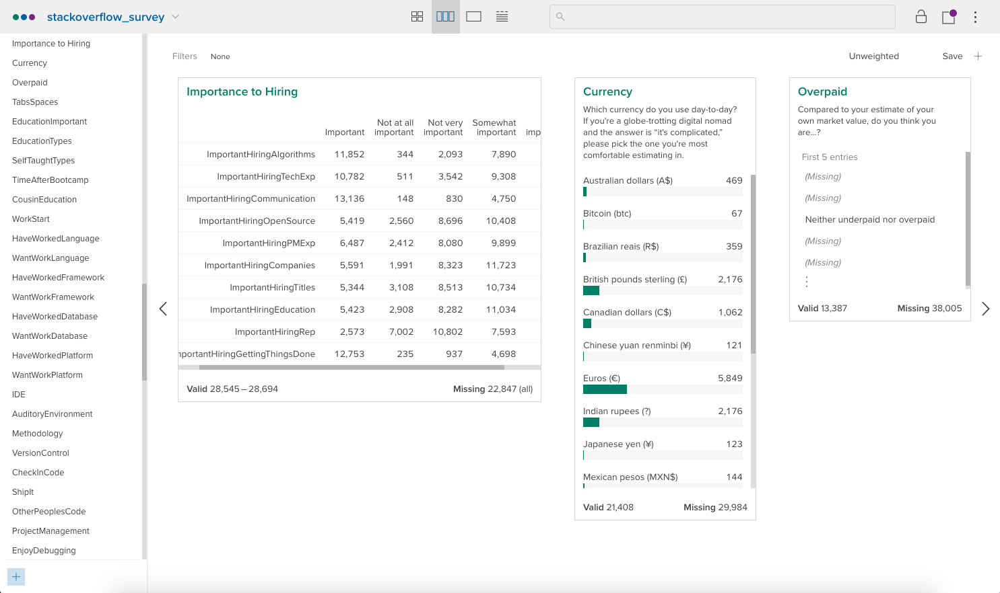
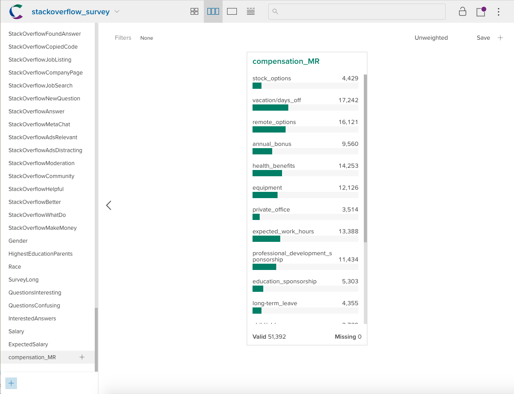

Analyzing the Stack Overflow developers survey in Crunch
========================================================

Survey designers often use data structures which make it easy to collect survey
responses even if those structures are somewhat difficult to analyze. The result
is that analysts can be faced with a number of tedious or difficult tasks before
they can actually get insight from the data. Crunch was developed to make it
easier to work with these kinds of awkward data structures. To provide a
concrete example, lets take a look at the [Stack Overflow developer
survey](https://insights.stackoverflow.com/survey/2017).

~~~~~~~~~~~~~~~~~~~~~~~~~~~~~~~~~~~~~~~~~~~~~~~~~~~~~~~~~~~~~~~~~~~~~~~~~~~~~~ r
library(crunch)
library(tidyverse)
library(stringr)
stack_df <- read_csv("survey_results_public.csv")
schema <- read_csv("survey_results_schema.csv")
~~~~~~~~~~~~~~~~~~~~~~~~~~~~~~~~~~~~~~~~~~~~~~~~~~~~~~~~~~~~~~~~~~~~~~~~~~~~~~~~

The first step is to upload the main survey to the crunch platform.

~~~~~~~~~~~~~~~~~~~~~~~~~~~~~~~~~~~~~~~~~~~~~~~~~~~~~~~~~~~~~~~~~~~~~~~~~~~~~~~~
ds <- newDataset(stack_df, name = "stackoverflow_survey")
~~~~~~~~~~~~~~~~~~~~~~~~~~~~~~~~~~~~~~~~~~~~~~~~~~~~~~~~~~~~~~~~~~~~~~~~~~~~~~~~

In the Crunch app we can take a look at some variable summaries to start to get
a sense of the data structure.

The StackOverflow questions are stored in two distinct formats, there's a human
readable version which is presented to the respondent, and a machine readable
one which is stored as the variable names. One of the first, and most frequent
questions that you'll likely ask when analyzing this survey is "what was that
question again?". The StackOverflow team has helpfully provided the survey
schema and Questionnaire which shows the relationship between the variable names
and the questions, but there's not a natural way to store this information in
either a csv file or an R dataframe. Storing the questions in the first row of
the table is not a great idea, so you will probably end up just keeping the
schema and questionnaire in separate files and cross-referencing them when
needed.

Crunch allows you to store more information than just the name about the
variable and so we can take the question information from the schema and assign
it to the variable description.

~~~~~~~~~~~~~~~~~~~~~~~~~~~~~~~~~~~~~~~~~~~~~~~~~~~~~~~~~~~~~~~~~~~~~~~~~~~~~~ r
descriptions(variables(ds)) <- schema$Question
~~~~~~~~~~~~~~~~~~~~~~~~~~~~~~~~~~~~~~~~~~~~~~~~~~~~~~~~~~~~~~~~~~~~~~~~~~~~~~~~

In the app the descriptions show up just under the variable name.

There are a couple of pieces of this survey which illustrate some of the pain
points faced by survey analysts. First let's take a look at Q149 which asks
respondents to rate how important various factors would be if they were the
hiring manager at a major technology company. When the question is asked all of
the possibilities are presented together:

>   Q491.Congratulations! You’ve just been put in charge of technical recruiting
>   at Globex, a multinational high-tech firm. This job comes with a corner
>   office, and you have an experienced staff of recruiters at your disposal.
>   All they need to be successful is a sense of the relative importance they
>   should place on each of the following when recruiting software developers.
>   What do you tell them?

>   Knowledge of algorithms and data structures

>   Experience with specific tools (libraries, frameworks, etc.) used by the
>   employer

>   Communication skills

>   Contributions to open source projects

>   Experience with specific project management tools & techniques

>   Previous companies worked at

>   Previous job titles held

>   Educational credentials (e.g. schools attended, specific field of study,
>   grades earned)

>   Stack Overflow reputation

But the limits of tabular data structures means that the answers to these
questions are broken up into a bunch of separate variables:

~~~~~~~~~~~~~~~~~~~~~~~~~~~~~~~~~~~~~~~~~~~~~~~~~~~~~~~~~~~~~~~~~~~~~~~~~~~~~~ r
vars <- schema$Column[str_detect( schema$Question, "Congratulations! You've just been put in charge of technical recruiting at Globex")]

stack_df %>%
    filter(row_number() ==1:10) %>%
    select(one_of(vars)) %>%
        knitr::kable()
~~~~~~~~~~~~~~~~~~~~~~~~~~~~~~~~~~~~~~~~~~~~~~~~~~~~~~~~~~~~~~~~~~~~~~~~~~~~~~~~

~~~~~~~~~~~~~~~~~~~~~~~~~~~~~~~~~~~~~~~~~~~~~~~~~~~~~~~~~~~~~~~~~~~~~~~~~~~~~~~~
## Warning in 1:51392 == 1:10: longer object length is not a multiple of
## shorter object length
~~~~~~~~~~~~~~~~~~~~~~~~~~~~~~~~~~~~~~~~~~~~~~~~~~~~~~~~~~~~~~~~~~~~~~~~~~~~~~~~

| ImportantHiringAlgorithms | ImportantHiringTechExp | ImportantHiringCommunication | ImportantHiringOpenSource | ImportantHiringPMExp | ImportantHiringCompanies | ImportantHiringTitles | ImportantHiringEducation | ImportantHiringRep   | ImportantHiringGettingThingsDone |
|---------------------------|------------------------|------------------------------|---------------------------|----------------------|--------------------------|-----------------------|--------------------------|----------------------|----------------------------------|
| Important                 | Important              | Important                    | Somewhat important        | Important            | Not very important       | Not very important    | Not at all important     | Somewhat important   | Very important                   |
| Important                 | Important              | Important                    | Important                 | Somewhat important   | Somewhat important       | Not very important    | Somewhat important       | Not very important   | Very important                   |
| NA                        | NA                     | NA                           | NA                        | NA                   | NA                       | NA                    | NA                       | NA                   | NA                               |
| Somewhat important        | Somewhat important     | Very important               | Very important            | Somewhat important   | Somewhat important       | Not very important    | Not very important       | Important            | Very important                   |
| NA                        | NA                     | NA                           | NA                        | NA                   | NA                       | NA                    | NA                       | NA                   | NA                               |
| Not very important        | Not very important     | Not very important           | Important                 | Not very important   | Not very important       | Not very important    | Not very important       | Not at all important | Not very important               |
| Very important            | Important              | Important                    | Somewhat important        | Somewhat important   | Somewhat important       | Somewhat important    | Somewhat important       | Not very important   | Very important                   |
| Somewhat important        | Somewhat important     | Important                    | Somewhat important        | Not very important   | Somewhat important       | Not very important    | Somewhat important       | Not very important   | Important                        |
| NA                        | NA                     | NA                           | NA                        | NA                   | NA                       | NA                    | NA                       | NA                   | NA                               |
| NA                        | NA                     | NA                           | NA                        | NA                   | NA                       | NA                    | NA                       | NA                   | NA                               |

A better solution would be to store the responses to this question in some kind
of tabular structure which showed the relationship between them. For instance we
could calculate a frequency table which showed the percentage of respondents who
gave a variable a particular rating. We can do this locally in R with something
like the following:

~~~~~~~~~~~~~~~~~~~~~~~~~~~~~~~~~~~~~~~~~~~~~~~~~~~~~~~~~~~~~~~~~~~~~~~~~~~~~~ r
catarray <- stack_df[, vars] %>%
    gather(variable, rating) %>%
    group_by(variable, rating) %>%
    tally() %>%
    filter(!is.na(rating)) %>%
    mutate(n = scales::percent(n/sum(n))) %>%
    spread(rating, n)
catarray$variable <- str_replace(catarray$variable, "ImportantHiring", "")
catarray[ ,c("variable", "Very important",
    "Important", "Somewhat important", "Not very important", "Not at all important")] %>%
    knitr::kable()
~~~~~~~~~~~~~~~~~~~~~~~~~~~~~~~~~~~~~~~~~~~~~~~~~~~~~~~~~~~~~~~~~~~~~~~~~~~~~~~~

| variable          | Very important | Important | Somewhat important | Not very important | Not at all important |
|-------------------|----------------|-----------|--------------------|--------------------|----------------------|
| Algorithms        | 22.6%          | 41.4%     | 27.5%              | 7.3%               | 1.2%                 |
| Communication     | 34.1%          | 45.9%     | 16.6%              | 2.9%               | 0.5%                 |
| Companies         | 3.2%           | 19.6%     | 41.1%              | 29.1%              | 7.0%                 |
| Education         | 3.5%           | 18.9%     | 38.5%              | 28.9%              | 10.1%                |
| GettingThingsDone | 34.8%          | 44.7%     | 16.5%              | 3.3%               | 0.8%                 |
| OpenSource        | 5.3%           | 19.0%     | 36.4%              | 30.4%              | 9.0%                 |
| PMExp             | 6.1%           | 22.7%     | 34.6%              | 28.2%              | 8.4%                 |
| Rep               | 2.3%           | 9.0%      | 26.5%              | 37.7%              | 24.5%                |
| TechExp           | 15.9%          | 37.6%     | 32.4%              | 12.3%              | 1.8%                 |
| Titles            | 3.0%           | 18.7%     | 37.6%              | 29.8%              | 10.9%                |

This picture is great for summarizing a set of related categorical variables,
but it's a bit of a pain to produce, and is difficult to display alongside other
variable summaries. Since this is such a common task, Crunch has a special data
type called a "categorical array" for working with related categorical
variables.

~~~~~~~~~~~~~~~~~~~~~~~~~~~~~~~~~~~~~~~~~~~~~~~~~~~~~~~~~~~~~~~~~~~~~~~~~~~~~~ r
ds$importanceHiringArray <- makeArray(ds[, vars], name = "Importance to Hiring")

~~~~~~~~~~~~~~~~~~~~~~~~~~~~~~~~~~~~~~~~~~~~~~~~~~~~~~~~~~~~~~~~~~~~~~~~~~~~~~~~

Another common survey response datatype can be found in Q350

>   Q350. When it comes to compensation and benefits, other than base salary,
>   which of the following are the most important to you? Please choose no more
>   than X.

>   \- Stock options

>   \- Retirement/pension contributions

>   \- Opportunity for an annual bonus

>   \- The number of annual days off (vacation, holidays, etc.)

>   \- Employer match of charitable contributions

>   \- Health benefits

>   \- Employer purchase of high-quality equipment (workstation, monitor, etc.)

>   \- Private office

>   \- Employer sponsorship of professional development (e.g. conference
>   attendance, course enrollment)

>   \- Employer sponsorship of education (e.g. tuition reimbursement)

>   \- Long-term leave policies (e.g. parental leave, sabbatical)

>   \- Number of expected work hours each week \* The ability to work from home

>   \- Child or elder care benefits

This is a multiple response question which allows respondents to select a number
of factors which they consider important. The responses are stored in semi-colon
delimited lists:

~~~~~~~~~~~~~~~~~~~~~~~~~~~~~~~~~~~~~~~~~~~~~~~~~~~~~~~~~~~~~~~~~~~~~~~~~~~~~~ r
stack_df[1:10, c("Respondent", "ImportantBenefits")] %>%
    knitr::kable()
~~~~~~~~~~~~~~~~~~~~~~~~~~~~~~~~~~~~~~~~~~~~~~~~~~~~~~~~~~~~~~~~~~~~~~~~~~~~~~~~

| Respondent | ImportantBenefits                                                                                       |
|------------|---------------------------------------------------------------------------------------------------------|
| 1          | Stock options; Vacation/days off; Remote options                                                        |
| 2          | NA                                                                                                      |
| 3          | NA                                                                                                      |
| 4          | Stock options; Annual bonus; Health benefits; Equipment; Private office                                 |
| 5          | NA                                                                                                      |
| 6          | Vacation/days off; Expected work hours                                                                  |
| 7          | Health benefits; Equipment; Professional development sponsorship; Education sponsorship; Remote options |
| 8          | Equipment; Professional development sponsorship; Expected work hours; Remote options                    |
| 9          | Stock options; Annual bonus; Health benefits; Equipment; Remote options                                 |
| 10         | Vacation/days off; Long-term leave; Expected work hours; Remote options; Child/elder care               |

The first task is to split up the responses into columns which show whether a
respondent selected a particular option.

~~~~~~~~~~~~~~~~~~~~~~~~~~~~~~~~~~~~~~~~~~~~~~~~~~~~~~~~~~~~~~~~~~~~~~~~~~~~~~ r
str_to_var <- function(str){
    str <- str[!is.na(str)]
    out <- data.frame(matrix(ncol = length(str), nrow = 1))
    out[1, ] <- "selected"
    names(out) <- str
    out
}
mr_vars <- stack_df$ImportantBenefits %>%
    str_split("; ") %>%
    map(str_to_var) %>%
    bind_rows()

head(mr_vars[, 1:5) %>%
    knitr::kable()
~~~~~~~~~~~~~~~~~~~~~~~~~~~~~~~~~~~~~~~~~~~~~~~~~~~~~~~~~~~~~~~~~~~~~~~~~~~~~~~~

| **Stock options** | **Vacation/days off** | **Remote options** | **Annual bonus** | **Health benefits** |
|-------------------|-----------------------|--------------------|------------------|---------------------|
| selected          | selected              | selected           | NA               | NA                  |
| Not Answered      | Not Answered          | Not Answered       | Not Answered     | Not Answered        |
| Not Answered      | Not Answered          | Not Answered       | Not Answered     | Not Answered        |
| selected          | NA                    | NA                 | selected         | selected            |
| Not Answered      | Not Answered          | Not Answered       | Not Answered     | Not Answered        |
| NA                | selected              | NA                 | NA               | NA                  |

This creates a dataframe with each multiple response option as a variable with
the selection indicated in the entries. We can now convert it to a factors and
upload it to Crunch.

~~~~~~~~~~~~~~~~~~~~~~~~~~~~~~~~~~~~~~~~~~~~~~~~~~~~~~~~~~~~~~~~~~~~~~~~~~~~~~ r
mr_vars[] <- map(mr_vars, as.factor)
names(mr_vars) <- str_replace_all(names(mr_vars), " ", "_") %>%
    str_to_lower()
var_defs <- map2(mr_vars, names(mr_vars), ~toVariable(.x, name = .y))
ds <- addVariables(ds, var_defs)
~~~~~~~~~~~~~~~~~~~~~~~~~~~~~~~~~~~~~~~~~~~~~~~~~~~~~~~~~~~~~~~~~~~~~~~~~~~~~~~~

The last step is to create the multiple response variable:

~~~~~~~~~~~~~~~~~~~~~~~~~~~~~~~~~~~~~~~~~~~~~~~~~~~~~~~~~~~~~~~~~~~~~~~~~~~~~~ r
ds$compensation_MR <- makeMR(ds[, names(mr_vars)],
    selections = "selected", name = "compensation_MR")
~~~~~~~~~~~~~~~~~~~~~~~~~~~~~~~~~~~~~~~~~~~~~~~~~~~~~~~~~~~~~~~~~~~~~~~~~~~~~~~~

### Correcting misreported salaries

Next we're going to replicate and extend a [procedure used by Evelina
Gabasova](http://evelinag.com/blog/2017/06-20-stackoverflow-tabs-spaces-and-salary/#.We4QuxNSxTY)
to correct for misreported salary data from Eastern Europe. Evelina noticed that
there were discrepancies in the distributions of salary data. For some
countries, even within countries, there was a multi-modal distribution of
salaries that she was surprised by. In fact, for a number of countries, it
looked like there were two distributions, one centered at approximately 1/12 of
the other. This lead her to wonder if maybe some developers from countries where
salaries are frequently given by month had actually reported their monthly
rather than yearly salaries.

Left alone, this would skew the salaries for the countries where this is common
much lower than reality. Inspired by Evelina's approach of using mixture models,
which she fit to the data and then corrected the low-salary group by multiplying
by 12 to get an annualized salary, we used mixture models and a some heuristics
to determine which countries had suspect distributions of salaries, and then
corrected those that fit this monthly-annual discrepancy. Like Evelina, we fit
mixture models using the [mclust
package](http://www.stat.washington.edu/mclust/). We fit mixture models for
every country, and then adjusted salaries under the following conditions: \* if
there is only one mode / cluster don't adjust the salaries. This is the simplest
case, if there's no discrepancy there's no reason to correct. \* if any mode /
cluster of salaries only represented 10% of the population, don't adjust the
salaries. We found that sometimes `mclust` would find very small clusters and
that would produce odd results, we chose 10% here out of convenience, but a more
principle approach would pick a better cut off. \* if there was more than one
mode / cluster of salaries, and the lowest group's salary multiplied by 12 was
greater than the second lowest group's salary multiplied by two, then do not
attempt to adjust the salaries. Sometimes `mclust` would find clusters, but they
would actually be fairly tightly together. This was likely the result of other
covariates like experience, but critically, we didn't want to multiply junior
developers' salaries by 12 just because they form a distinct cluster separate
from senior developers. \* otherwise, multiply the lowest salary group by 12 to
correct for apparent misreporting.

Finally, we only applied this adjustment to countries where we had at least 90
responses. This allowed us to be reasonably confident that there were enough
salaries in the sample to detect distinct clusters.

~~~~~~~~~~~~~~~~~~~~~~~~~~~~~~~~~~~~~~~~~~~~~~~~~~~~~~~~~~~~~~~~~~~~~~~~~~~~~~ r
library(crplyr)
library(mclust)
adjFrame <- ds %>% 
    select(Salary, Country, Respondent) %>% 
    collect()

adjustSalary <- function(df) {
    res <- Mclust(df$Salary)
    df$adjSalary <- df$Salary
    df$Group <- res$classification
    summaryDf <- df %>%
        group_by(Group) %>%
        summarise(mean = mean(Salary), n=n())
    if(any(summaryDf$n < nrow(df) / 10)){
        # if any cluster is smaller than 1/10 of the sample, don't adjust salaries
        df$adjSalary <- df$Salary
        return(df)
    }
    if(nrow(summaryDf) > 1 && mean(df$adjSalary[df$Group==1])*12 > mean(df$adjSalary[df$Group==2])*2){
        # if the lowest cluster*12 is greater than the second lowest*2, then the
        # correction is over-aggressive, so don't adjust salaries
        df$adjSalary <- df$Salary
        return(df)
    } else if (nrow(summaryDf) == 1){
        # if there is a single cluster, don't adjust the salaries
        df$adjSalary <- df$Salary
        return(df)
    }
    # otherwise, multiple group 1's salaries by 12
    df <- df %>%
        mutate(adjSalary = case_when(Group == 1 ~ Salary * 12,
                                         TRUE ~ Salary))
    return(df)
}

adjusted <- adjFrame %>%
    filter(!is.na(Salary)) %>%
    group_by(Country)  %>%
    filter(n() >= 90) %>%
    do(adjustSalary(.)) %>%
    ungroup() %>% 
    right_join(adjFrame[, "Respondent"], by = "Respondent")
~~~~~~~~~~~~~~~~~~~~~~~~~~~~~~~~~~~~~~~~~~~~~~~~~~~~~~~~~~~~~~~~~~~~~~~~~~~~~~~~

 

We can then upload the data back up to the Crunch app to see that the small
outlying salaries have been smoothed over the rest of the distribution.

 

~~~~~~~~~~~~~~~~~~~~~~~~~~~~~~~~~~~~~~~~~~~~~~~~~~~~~~~~~~~~~~~~~~~~~~~~~~~~~~~~
ds$adjSalary <- adjusted$adjSalary
~~~~~~~~~~~~~~~~~~~~~~~~~~~~~~~~~~~~~~~~~~~~~~~~~~~~~~~~~~~~~~~~~~~~~~~~~~~~~~~~

 

